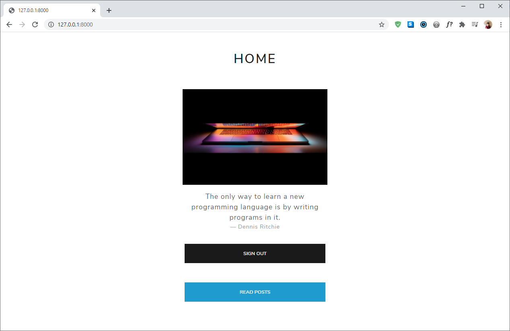
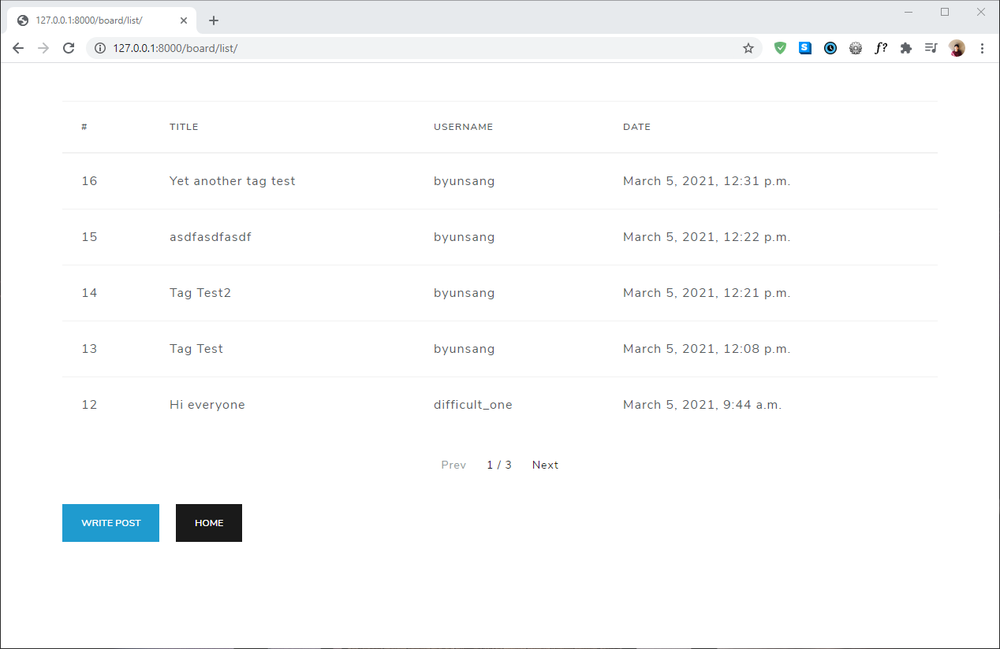
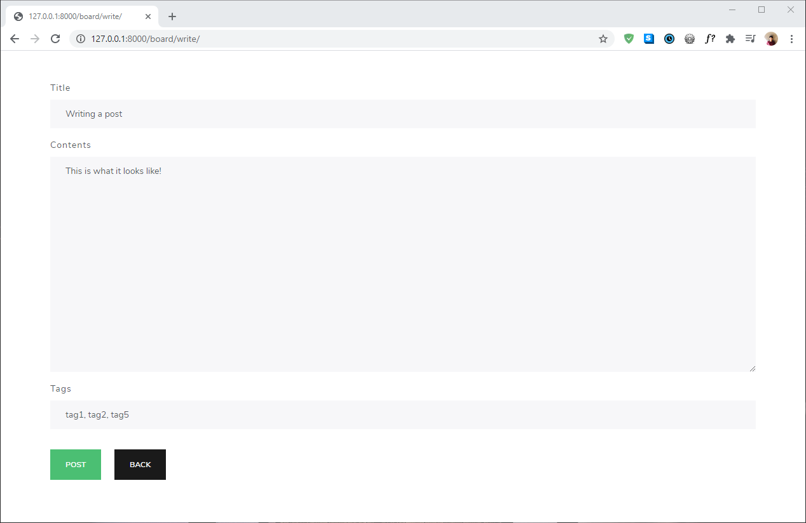

# django-practice-1

## Descriptions

This is a small Django exercise for myself to practice Django and Bootstrap. The code will generate a minimalistic publishing website with basic features like registering, sign-in, sign-out, tagging, and publishing/reading posts. The Bootstrap template used here is called [Lux](https://bootswatch.com/lux/) and more temnplates can be found in [Bootswatch](https://bootswatch.com/).

## Installation

The only package I installed was Django (version 3.1.7)

```bash
pip install django
```

## Demonstrations

This is what the main page looks like when you're not logged in.


We can go to the registration page to create a new account.


Now we can sign in to the webiste.


This is what the main page looks like when you're logged in.


When we click 'Read Posts', we get a list of different posts published by all the users.


We can read a post.


And we can write one as well.

